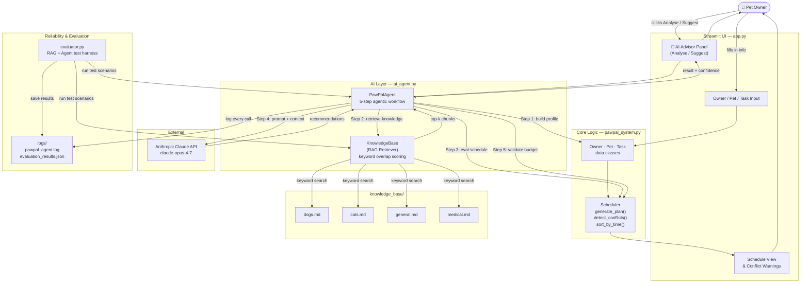

# PawPal+ System Architecture Diagram

Export this Mermaid diagram to PNG using https://mermaid.live and save it as `assets/architecture.png`.

## Component descriptions

| Component | File | Purpose |
|---|---|---|
| Streamlit UI | `app.py` | User-facing interface — input forms, schedule table, AI Advisor panel |
| Core logic | `pawpal_system.py` | Owner, Pet, Task, Scheduler — all rule-based scheduling |
| RAG retriever | `ai_agent.py → KnowledgeBase` | Loads markdown docs, retrieves top-k chunks by keyword overlap |
| Agentic workflow | `ai_agent.py → PawPalAgent` | 5-step reasoning: profile → retrieve → evaluate → recommend → validate |
| Knowledge base | `knowledge_base/*.md` | 4 curated documents: dogs, cats, general, medical |
| Claude API | Anthropic cloud | Generates natural-language recommendations from retrieved context |
| Evaluator | `evaluator.py` | Test harness: KB retrieval tests (offline) + agent tests (live API) |
| Logs | `logs/` | Agent call log + JSON evaluation results for auditability |
