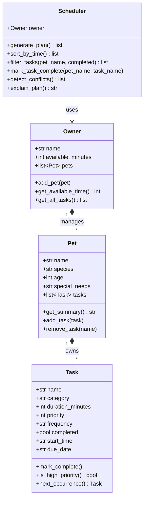

# PawPal+ — Final Class Diagram

## Key changes from initial design

| Change | Reason |
|---|---|
| `Task` gained `start_time`, `due_date`, `frequency`, `next_occurrence()` | Needed for sorting, recurrence, and conflict detection |
| `Pet` now owns a `list[Task]` | Tasks belong to a specific pet, not a global list |
| `Owner` now manages `list[Pet]` | Multi-pet support required for realistic scheduling |
| `Scheduler` gained `sort_by_time()`, `filter_tasks()`, `detect_conflicts()` | Phase 3 algorithm features |
| `Scheduler` no longer holds `tasks` directly | Tasks are owned by `Pet`; Scheduler retrieves them via `Owner.get_all_tasks()` |
